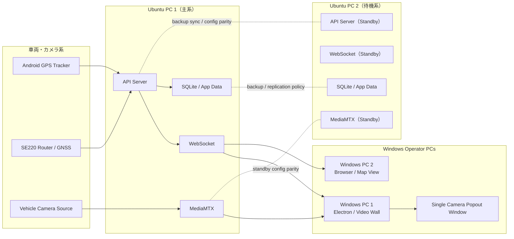

# Kurukuru Monitor Phase 2 クライアント要件整理および実装計画

## Executive Summary

本書は、Kurukuru Monitor の次段階導入に向けたクライアント要件を整理し、現行システムの画面設計を大きく変えずに実現可能な最小リスクの実装計画を示すものである。  
今回の主題は、以下の 4 点である。

- Ubuntu 2 台を用いた本番・待機系の配置検討
- オペレーター/管理者の画面権限制御
- 映像ウォールからの単一カメラ Popout 挙動改善
- 別 Windows PC のブラウザから閲覧できる地図画面の提供

クライアント要望に対する最重要方針は、**現行 UI レイアウトを維持し、必要最小限の変更のみで運用性を高めること**である。  
そのため、最初に着手すべきタスクは、既存メニューを役割に応じて表示制御し、ヘッダー右側へ自然な `Admin Login/Logout` 導線を追加する Phase 1 とする。

## Recommended Architecture

推奨構成は以下のとおりである。

- Ubuntu PC 1: 主系バックエンドサーバー
- Ubuntu PC 2: 待機系バックエンドサーバー
- Windows PC 1: 主に映像ウォール運用
- Windows PC 2: 主に地図画面をブラウザ運用

システム全体は同一ローカルネットワーク上に配置し、主系 Ubuntu PC に API / WebSocket / MediaMTX を集約する。  
待機系 Ubuntu PC は同一アプリケーション構成を維持し、障害時に切替可能な状態を保つ。  
Windows 側は、Electron クライアントを映像ウォール用途に、ブラウザを地図専用表示用途に分担することで、3 画面運用に適した構成とする。

## Deployment Topology Diagram

## UI Permission Model

役割は最小構成で以下の 2 種とする。

### 1. Normal Operator

通常オペレーターは以下のみ閲覧可能とする。

- `映像ウォール`
- `地図画面`

以下は非表示とする。

- `システム状態`
- `設定`

### 2. Admin

管理者ログイン後は以下を閲覧可能とする。

- `映像ウォール`
- `地図画面`
- `システム状態`
- `設定`

管理者は明示的にログアウト可能とし、ログアウト後は即時に通常オペレーター表示へ戻す。

### Permission Model Principles

- 初期状態は必ず通常オペレーターとする
- 管理者権限は明示的ログイン時のみ有効化する
- 管理者権限はログアウトにより明示的に解除できるようにする
- 権限差分は「既存メニュー項目の表示/非表示」を基本にする
- ページ全体の再設計は行わない

## UI Non-Redesign Rule

クライアント要件上、現行 UI デザインおよびレイアウトは概ね良好と評価されている。  
したがって、本フェーズでは以下を厳守する。

- 既存ナビゲーション構造を維持する
- 既存ページ構成を維持する
- 既存カード、余白、色、レイアウトを変更しない
- 追加 UI は管理者ログイン/ログアウト導線の最小追加に留める
- 既存デザイン言語に合うボタン表現を採用する

本フェーズで許容される視覚変更は、**管理者ボタン 1 点の追加**と、**権限に応じた既存メニューの表示制御**のみである。

## Admin Button Placement Recommendation

推奨配置は、**アプリケーションヘッダー右側**である。

理由は以下のとおり。

- 既存レイアウトへの干渉が最小
- オペレーター画面の主要導線を壊さない
- ログイン/ログアウトというセッション操作はヘッダー配置と整合する
- 管理権限の有効/無効状態を視認しやすい

推奨仕様:

- 通常時: `管理者ログイン`
- ログイン後: `管理者ログアウト`
- 必要であれば現在ロール表示を小さく補助表示
- 既存ボタン、ヘッダー、カードと同系統のスタイルを使用

代替案として既存の右上コントロールエリアがある場合は、その中へ統合してもよい。ただし新規パネルや新規サイドバー追加は非推奨とする。

## Video Popout Design

### Required Behavior

現行のダブルクリック全画面表示挙動を、以下へ変更する。

- カメラをダブルクリックすると、単一カメラ専用ウィンドウを開く
- すでに単一カメラウィンドウが開いている場合は、新規ウィンドウを増やさず、その既存ウィンドウの表示対象カメラを切り替える
- 複数の Popout ウィンドウは作成しない

### Operational Intent

想定運用は 3 画面構成である。

- 画面 1: メインアプリまたは映像ウォール
- 画面 2: 単一カメラ Popout
- 画面 3: 地図画面またはブラウザ地図

### Design Recommendation

- Electron 側で単一インスタンスの camera popout window を管理する
- ダブルクリック時は `openOrUpdateSingleCameraWindow(cameraId)` のような責務に統一する
- Popout が未生成なら生成、既存なら対象カメラのみ差し替える
- ウィンドウ位置・サイズは再利用し、毎回複数生成しない

本設計により、オペレーターが複数ウィンドウを整理する負担を避けられる。

## Browser Map Design

クライアント要件として、別 Windows PC からブラウザで地図表示を利用したいという要望がある。  
このため、Electron 専用画面とは別に、同一 LAN 内からアクセス可能な地図 URL を提供する設計が必要である。

推奨方針:

- 地図ページは既存 Map UI を活用する
- API / WebSocket は Ubuntu 主系へ向ける
- Windows PC 2 はブラウザで地図 URL にアクセスする
- アクセス URL は固定的かつ現場で案内しやすい形式にする

例:

- `http://<ubuntu-main-ip>:<port>/map`
- または既存フロントエンド公開方式に応じた専用地図ルート

重要点:

- ブラウザ版は「地図を安定表示すること」を主目的とする
- 管理画面まで広げず、まずは map-only または operator-safe view を優先する
- 認証・公開範囲は LAN 内前提であっても整理が必要

## Backup / Failover Design

### Basic Requirement

Ubuntu PC 1 に障害が発生した場合、Ubuntu PC 2 へ切替できることが要件である。

### Recommended Approach

初期段階では、完全自動フェイルオーバーよりも**手順明確な準待機系運用**を推奨する。

- Ubuntu PC 1: 主系サービス常時稼働
- Ubuntu PC 2: 同一バージョン・同一設定で待機
- 障害時は運用手順に従い PC 2 を主系として切替

### Why Manual or Semi-Manual First

- SQLite を含むため、即時自動切替はデータ整合性設計を伴う
- MediaMTX、API、WebSocket、設定同期の扱いを整理する必要がある
- まずは「確実に切替できる」手順を固める方が導入リスクが低い

### Future Failover Options

将来的には以下を検討できる。

- 仮想 IP または DNS 切替
- 設定同期自動化
- DB レプリケーション見直し
- SQLite からより HA に適した DB への移行

## Implementation Phases

### Phase 1: Operator/Admin Menu Permissions

目的:

- 通常オペレーターと管理者で見えるメニューを分離する
- 現行 UI を崩さずに管理者導線を追加する

実装方針:

- デフォルトは通常オペレーター
- 既存メニューを role に応じて hide/show
- ヘッダー右側に小さな `管理者ログイン/ログアウト` ボタンを追加
- レイアウト変更は最小限に限定

### Phase 2: Single Camera Popout Window

目的:

- ダブルクリック時の映像確認体験を改善する

実装方針:

- 単一 Popout ウィンドウのみ許可
- 既存ウィンドウがある場合はその中身だけ更新
- 複数 Popout 生成を防止

### Phase 3: Browser Map View

目的:

- 別 Windows PC からブラウザで地図閲覧できるようにする

実装方針:

- LAN 内向けの地図 URL を提供
- 既存地図画面を再利用
- operator-safe な表示範囲に絞る

### Phase 4: Ubuntu Deployment Service Setup

目的:

- Ubuntu 2 台で同一サービス構成を安定運用できる状態を作る

実装方針:

- systemd サービス化
- 環境変数と起動順の標準化
- API、WebSocket、MediaMTX の起動確認手順整備

### Phase 5: Backup Server / Failover

目的:

- 主系障害時の切替を運用可能な形で確立する

実装方針:

- まずは手動または準自動切替
- 切替手順書整備
- 必要に応じて将来の自動化を別フェーズ化

## Risks and Decisions

### Main Risks

- UI を触りすぎると、クライアントが評価している現行レイアウトを損ねる
- 管理者権限の扱いを広げすぎると要件が膨らむ
- Popout を複数化すると現場運用が複雑化する
- ブラウザ版公開時に、認証や LAN 内アクセス制御の整理が必要
- Ubuntu 2 台の自動フェイルオーバーは SQLite 前提では慎重設計が必要

### Required Decisions

- 管理者ログインの認証方式
- ブラウザ版地図の公開 URL と認証有無
- 主系/待機系切替の運用手順
- データ同期方式の将来方針

## Recommended First Task

最初に実施すべきタスクは **Phase 1: Operator/Admin Menu Permissions** である。

理由:

- UI 変更量が最小
- クライアント要件に最も直接的に応える
- 現行画面の評価を維持できる
- 実装・確認・受入れが比較的短期間で進めやすい
- 次フェーズのブラウザ表示や設定保護の前提になる

推奨初回実装範囲:

- デフォルト operator モード
- `映像ウォール` と `地図画面` のみ表示
- ヘッダー右側へ `管理者ログイン` ボタン追加
- ログイン後に `システム状態` と `設定` を表示
- `管理者ログアウト` で operator モードへ復帰

## Acceptance Criteria

### Phase 1 Acceptance

- 初期表示で通常オペレーター向けメニューのみ表示される
- `映像ウォール` と `地図画面` は通常時に利用可能
- `システム状態` と `設定` は通常時に表示されない
- ヘッダー右側に自然な管理者ログイン導線が存在する
- 管理者ログイン後、追加メニューが表示される
- 管理者ログアウト後、追加メニューが再び非表示になる
- 既存 UI のデザイン・余白・配色・ナビゲーション構造が維持される

### Phase 2 Acceptance

- カメラダブルクリックで単一カメラウィンドウが開く
- 既存 Popout が開いている場合、別カメラをダブルクリックすると同じウィンドウの中身だけ切り替わる
- 複数 Popout ウィンドウは生成されない

### Phase 3 Acceptance

- 別 Windows PC からローカル URL で地図画面を開ける
- 同一 LAN 内で安定して地図と車両情報が見える
- 運用上不要な管理機能がブラウザ地図に露出しない

### Phase 4 Acceptance

- Ubuntu 2 台で同一サービス構成を再現できる
- 起動・停止・再起動手順が明文化される
- API / WebSocket / MediaMTX の動作確認が可能

### Phase 5 Acceptance

- Ubuntu PC 1 障害時の切替手順が確立している
- Ubuntu PC 2 で代替稼働できる
- 運用担当者が切替判断と実行を行える

## Final Recommendation

導入順序は次のとおり推奨する。

1. Phase 1: Operator/Admin Menu Permissions
2. Phase 2: Single Camera Popout Window
3. Phase 3: Browser Map View
4. Phase 4: Ubuntu Deployment Service Setup
5. Phase 5: Backup Server / Failover

この順序であれば、UI 変更リスクを最小化しつつ、オペレーター運用改善、監視運用改善、ネットワーク利用拡張、サーバー冗長化の順に無理なく進められる。特に Phase 1 は、クライアントの「現行デザインは維持したい」という意向に最も整合するため、最優先で着手すべきである。

## Phase 1 Implementation Notes

Phase 1 の実装では、現行 UI の再設計は行わず、既存ダッシュボードと既存ヘッダーの構成を維持したまま権限差分のみを追加する方針とする。

- 初期ロールは `operator`
- `operator` では `映像ウォール` と `地図画面` のみを表示
- `admin` ログイン後に `システム状態` と `設定` を表示
- 右上ヘッダー領域へ小型の `管理者ログイン / 管理者ログアウト` 導線を追加
- ログイン UI はコンパクトなモーダルで実装
- フロントエンドのみの固定パスワード判定は行わず、バックエンド認証を使用
- 認証 API は `POST /api/auth/login` と `GET /api/auth/me` を最小構成で追加
- 管理者セッションは軽量な署名付きトークン方式とし、フロント側は `sessionStorage` 保持を基本とする
- 非管理者が `システム状態` または `設定` へ直接遷移した場合は安全な画面へ戻す

### Remaining TODOs

- 設定系 API / IPC の細粒度な admin ガード強化
- Electron メインプロセス経由 API への admin session 伝播整理
- 管理者ログイン失敗監査や試行回数制限の検討
- ブラウザ map view 公開時の認証整理

### Phase 1 Layout Refinement Notes

- operator UI は `映像ウォール` と `地図画面` の 2 枚のみを大きく中央配置する
- admin UI は `映像ウォール`、`地図画面`、`システム状態`、`設定` の 4 枚構成へ展開する
- 言語セレクターは撤去し、日本語運用前提の固定 UI とする
- 既存 UI デザインは維持し、役割ごとのメニュー見え方だけを整える

## Phase 3 Implementation Notes

- browser 用 map-only route として `#/operator/map` を追加する
- 既存の `MapPage` / `MapPanel` / GPS feed / map controls を再利用し、dashboard menu や admin controls は表示しない
- 開発時の確認 URL 例は `http://<server-ip>:5173/#/operator/map`
- 本番時の URL は配備方式に応じて `http://<server-ip>/#/operator/map` もしくは同等の static hosting path を利用する
- Windows PC #2 はこの URL を Chrome / Edge で開き、必要に応じて F11 全画面表示で運用する
- `VITE_API_BASE_URL` は `127.0.0.1` ではなく、到達可能な backend address 例 `http://<ubuntu-server-ip>:4000` を設定する
- LAN 上の別 PC から開発 renderer にアクセスできるよう、desktop renderer の Vite dev server は `host: 0.0.0.0` で公開する
