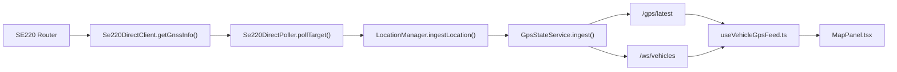
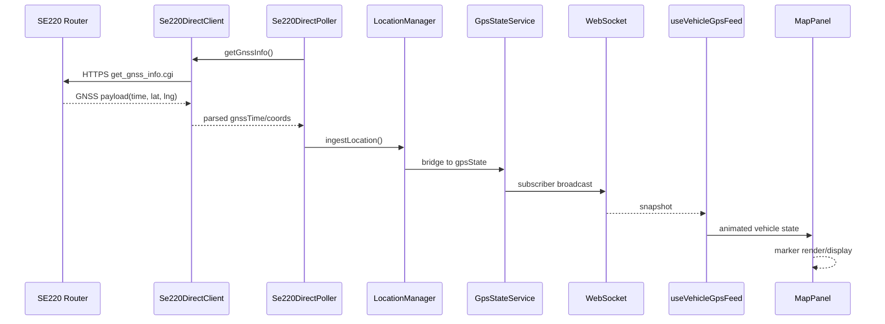

# GNSS Location Logic Review

## Executive Summary

Kurukuru Monitor の SE220 直ポーリング実装は、現状でも「おおむねリアルタイム」に近い GNSS 更新は可能ですが、**厳密な 1 秒更新を安定運用するには追加改善が必要**です。特に重要なのは次の 4 点です。

1. 現在の `Se220DirectPoller` は各ルーターを並列取得していますが、**次サイクル開始が「前サイクル完了後 + 1000ms」** になっているため、実効更新周期は 1 秒を超えやすいです。
2. `SE220_DIRECT_REQUEST_TIMEOUT_MS=3000` と `SE220_DIRECT_POLL_INTERVAL_MS=1000` の組み合わせは、**slow poll を 3 秒まで引きずる**ため、厳密な 1 秒 cadence に不向きです。
3. ルーター由来の `gnssTime` が古くても、バックエンドとフロントエンドは主に **API 受信時刻 `receivedAt` ベースで鮮度判定**しているため、**古い GNSS サンプルが ONLINE に見える**可能性があります。
4. フロントエンドの補間アニメーションは `900ms` で、ポーリング目標 `1000ms` にかなり近く、**視覚的な遅延感や「常に追いつき切らない」印象**を生みやすいです。

結論として、現行コードは「SE220 直ポーリングの基礎」としては良い状態ですが、**strict 1-second GNSS operation の観点では改善が必要**です。とくに、ルーター単位の独立ポーリングループ、`gnssTime` と `receivedAt` の分離監視、duplicate heartbeat の明示処理、タイムアウト短縮、監視メトリクス追加を推奨します。

## Current Implementation Summary

### 対象確認ファイル

- `apps/api/src/services/location/se220-direct-poller.ts`
- `apps/api/src/services/location/se220-direct-client.ts`
- `apps/api/src/services/location/location-manager.ts`
- `apps/api/src/services/location/types.ts`
- `apps/api/src/services/gps-state.ts`
- `apps/api/src/routes/gps.ts`
- `apps/api/src/routes/locations.ts`
- `apps/api/src/routes/fleet.ts`
- `apps/api/src/server.ts`
- `apps/api/src/websocket.ts`
- `apps/desktop/src/hooks/useVehicleGpsFeed.ts`
- `apps/desktop/src/components/MapPanel.tsx`
- `README.md`
- `docs/SYSTEM_ARCHITECTURE.md`
- `docs/DEPLOYMENT_GUIDE.md`

### 実装要約

- SE220 直ポーリングは `Se220DirectPoller` が担当します。
- ポーラーは `server.ts` で `LocationManager` に provider 登録され、API 起動時 `locationManager.start()` で開始されます。
- ポーリング対象は環境変数 `SE220_DIRECT_POLLERS` を `vehicleId|routeId|routerBaseUrl|username|password` または token 形式で解釈して構成されます。
- 取得結果は `LocationManager.ingestLocation()` へ正規化投入され、その後 `GpsStateService.ingest()` へ bridge されます。
- `/gps/latest` は `GpsStateService` の latest view を返し、`/ws/vehicles` は同じ latest snapshot を WebSocket で配信します。
- デスクトップは `useVehicleGpsFeed.ts` で WebSocket を主経路、`/gps/latest` を補助経路として受け、`MapPanel.tsx` でマーカー描画します。

## Current Data Flow

### データフロー概要

`SE220 router -> direct poller -> location manager -> gps state -> HTTP/WebSocket -> desktop feed hook -> map marker`



### どこでポーリングが始まるか

- `apps/api/src/server.ts`
  - `const se220DirectPoller = new Se220DirectPoller(locationManager, app.log);`
  - `locationManager.registerProvider(se220DirectPoller);`
  - `onReady` 内の `await locationManager.start();` で provider start

### 各ルーターの設定方法

- `apps/api/src/services/location/se220-direct-poller.ts`
  - `SE220_DIRECT_POLLERS` を `parseDirectPollers()` で解析
  - 形式:
    - `vehicleId|routeId|baseUrl|token`
    - `vehicleId|routeId|baseUrl|username|password`
- `allowSelfSigned`、`requestTimeoutMs`、`authLockCooldownMs` は環境変数から注入

### GNSS 応答の解析

- `apps/api/src/services/location/se220-direct-client.ts`
  - `GET /api/get_gnss_info.cgi?token=...`
  - `response.data.time` -> `gnssTime`
  - `response.data.latitude` -> `latitude`
  - `response.data.longitude` -> `longitude`
  - `raw` に元レスポンスを保持

### vehicleId / routeId の割り当て

- `SE220_DIRECT_POLLERS` の文字列から直接割り当て
- 自動推定ではなく、**環境設定が唯一のマッピング根拠**です

### latest location の保存

- `LocationManager.latestByVehicle`
  - `vehicleId` ごとの最新 `VehicleLocation`
- `GpsStateService.latestByVehicle`
  - デスクトップ向け legacy/latest view
- `GpsStateService.persistQueue`
  - `gpsPoint` 保存用キュー

### 古い / stale data の扱い

- `Se220DirectPoller` は `routerSampleAgeMs >= 15000` で stale warning を出します
- ただし payload `status` は **常に `LocationStatus.ONLINE`** です
- `LocationStatus.STALE` は enum に存在しますが、SE220 直ポーラーからは現状ほぼ使われていません
- フロントエンドの `ONLINE / DELAYED / OFFLINE` 判定は `receivedAt` ベースです
- したがって、**ルーターが古い `gnssTime` を返し続けても、ポーリング自体が成功していれば ONLINE に見えることがあります**

### WebSocket メッセージの送出

- `apps/api/src/websocket.ts`
  - `gpsState.subscribe()` で更新検知
  - enabled vehicle を DB から再確認
  - `type: "snapshot"` 形式で全車両 snapshot を各クライアントへ送信
- `type: "update"` は受信側に分岐はありますが、現状送信は snapshot 中心です

### デスクトップでの受信とマーカー移動

- `apps/desktop/src/hooks/useVehicleGpsFeed.ts`
  - WebSocket snapshot 受信
  - HTTP `/gps/latest` fallback 受信
  - `targetsRef` に current/source/target 座標と animation state を保持
  - 毎 frame `requestAnimationFrame` で線形補間
- `apps/desktop/src/components/MapPanel.tsx`
  - Google Maps / Mapbox の両方に同じ view model を描画
  - follow, 3D, pan/drag, marker selection は地図 provider 非依存の state として管理

## 1-Second Update Behavior

### 現行実装で 1 秒更新は成立するか

結論として、**「成功することはあるが、厳密 1 秒周期は保証されない」** 実装です。

### タイマー / ループ構造

- `Se220DirectPoller.start()`
  - 最初に `await this.runCycle()`
  - 完了後に `scheduleNextCycle()`
- `scheduleNextCycle()`
  - `setTimeout(..., this.pollIntervalMs)`
  - callback 内で `runCycle()` 実行
  - `finally` で次回 schedule

このため実効周期は次式になります。

`effective cycle = runCycle duration + pollIntervalMs`

例:

- poll が 150ms で完了 -> 次開始は約 1150ms 後
- poll が 800ms で完了 -> 次開始は約 1800ms 後
- poll が 3000ms timeout -> 次開始は約 4000ms 後

### slow request の overlap 有無

- 各 target には `state.inFlight` があり、同一ルーターの重複取得は防止されています
- よって **同一ルーターで request overlap は起きません**
- ただし、ルーターごとの独立スケジューラではないため、**一台の slow poll が全体 cadence を遅らせます**

### 複数ルーターは sequential か parallel か

- `runCycle()` は `await Promise.all(this.targets.map((target) => this.pollTarget(target)))`
- よって **同一 cycle 内では並列取得**です
- この点は良い設計です
- ただし次 cycle は `Promise.all` 完了待ちなので、**slowest router が global cycle を支配**します

### エラー時の次回影響

- `pollTarget()` 自身が内部で `catch` して `throw` しないため、1 台の失敗で `Promise.all` 全体は reject しません
- したがって **router-1 failure が router-2 を直接止めることはありません**
- ただし slow failure はその cycle 完了時刻を遅らせます

### 毎サンプルごとの API / WebSocket 配信

- successful sample ごとに `LocationManager.ingestLocation()` -> `GpsStateService.ingest()` -> `gpsState.subscribe()` が走るため、**成功サンプルは毎回 broadcast** されます
- ただし WebSocket は update 差分ではなく snapshot 再配信です

### duplicate coordinate は skip されるか

- バックエンド:
  - `duplicateSample` は investigation に記録されます
  - しかし sample 自体は **破棄されず** ingest されます
- フロントエンド:
  - duplicate 扱いは `sameCoordinates && sameReceivedAt`
  - SE220 poll 成功時は `receivedAt` が毎回更新されるため、**同一座標でも通常 duplicate 扱いになりません**
  - 結果として heartbeat は見えますが、move ではないサンプルも通常処理されます

### フロントエンド補間による visible delay

- `useVehicleGpsFeed.ts` の marker animation は `900ms`
- poll target が `1000ms` のため、**描画は常に次サンプル直前まで補間中**になりやすいです
- 実際の GNSS 到達より、オペレーターには少し遅れて見える可能性があります

## Timing and Latency Investigation

### 現在取れている主な investigation フィールド

- `localPollTime`
- `apiPollReceivedAt`
- `routerGnssTime`
- `routerSampleAgeMs`
- `coordinateChanged`
- `intervalSinceLastCoordinateChangeMs`
- `distanceFromPreviousMeters`
- `speedEstimateMps`
- `headingEstimateDeg`
- `suspiciousJump`
- `duplicateSample`
- `locationManagerReceivedAt`
- `locationManagerUpdatedAt`
- `locationManagerProcessingMs`
- `gpsStateIngestedAt`
- `backendProcessingMs`
- `websocketBroadcastAt`
- `websocketBroadcastLatencyMs`
- `latestApiResponseAt`
- `apiResponseGenerationMs`
- フロントエンド側:
  - `frontendMessageReceivedAt`
  - `frontendMarkerUpdateAt`
  - `frontendRenderCompleteAt`
  - `frontendDisplayAt`

### シーケンス



### 現在不足しているログ / 指標

現在の telemetry はかなり良いですが、strict 1-second 運用では次を追加したいです。

- `requestStartedAt`
- `requestCompletedAt`
- `requestDurationMs`
- `cycleStartedAt`
- `cycleCompletedAt`
- `effectiveUpdateIntervalMs`
- `routerId` または `routerBaseUrlHash`
- `pollSkippedBecauseInFlight`
- `pollSkippedBecauseAuthCooldown`
- `gnssTimeAgeAtBroadcastMs`
- `gnssTimeAgeAtFrontendMs`

## Accuracy, Jitter, and Duplicate Sample Handling

### same coordinate repeated

- 現状は duplicate として記録されるが、**heartbeat としては ingest 継続**されます
- この方向性自体は良いです
- ただし duplicate sample と moved sample の扱いがまだ同列で、画面上の意味分離が弱いです

### stale `gnssTime`

- `routerSampleAgeMs` は算出済み
- しかし status へ反映していないため、**古い GNSS サンプルが ONLINE として流れる**危険があります

### stationary vehicle jitter

- バックエンドで coordinate change / distance / estimated speed は算出済み
- ただし waiting/stationary 専用の jitter suppression は未実装です
- フロントエンドでは同一点でも `receivedAt` 更新のたびに再補間が走ります

### suspicious jump

- `speedEstimateMps > 35` を suspicious として investigation 記録
- `LocationManager.detectImpossibleJump()` では約 `150km/h` 超を reject
- この二段階は有用です
- ただし SE220 直ポーラー段階の suspicious flag と LocationManager reject 閾値は別管理で、運用基準がやや分散しています

### estimated speed / heading

- 元データから直接ではなく、座標差分から推定
- サンプル間隔が乱れると推定値の安定性も落ちます
- effective interval を一緒に記録するほうが妥当です

### accuracyMeters / gpsQuality

- SE220 直ポーラー payload では `accuracyMeters` を出していません
- そのため `LocationManager` 側で `gpsQuality` はほぼ `UNKNOWN`
- 位置品質判断としては不足です

### offline / delayed 判定

- デスクトップの `toStatus(ageSeconds)` は `receivedAt` ベース
- 0-5 sec = ONLINE
- 6-15 sec = DELAYED
- 15+ sec = OFFLINE
- つまり「ポーリング成功しているがルーター GNSS が止まっている」ケースを検知しにくいです

### 実車監視としての適合性

- 構造自体は良いです
- ただし strict monitoring では **通信生存** と **位置更新生存** を分ける必要があります
- 現状は `receivedAt` が優先されるため、通信 alive が位置 alive に見えやすいです

## Findings

1. `Se220DirectPoller` は per-cycle parallel poll だが、**per-router independent loop ではない**
2. `pollIntervalMs=1000` でも、実効周期は `poll duration + 1000ms`
3. `requestTimeoutMs=3000` は strict 1-second には長すぎる
4. `state.inFlight` により overlap は防止されている
5. router stale sample は log されるが、**status には昇格しない**
6. WebSocket は successful sample ごとに snapshot broadcast している
7. duplicate sample は broadcast されるため、online heartbeat としては使える
8. frontend animation `900ms` は 1 秒 cadence に近すぎる
9. HTTP fallback は WebSocket 接続中は抑制されているが、health-check polling は毎秒残っている
10. `SE220_DIRECT_ALLOW_SELF_SIGNED=true` 時、`NODE_TLS_REJECT_UNAUTHORIZED` を process-wide で変更しており、**セキュリティと並行処理上のリスク**がある
11. `README.md` は有用だが、`docs/SYSTEM_ARCHITECTURE.md` と `docs/DEPLOYMENT_GUIDE.md` は現環境の表示上文字化けが見られ、二次資料としての信頼性確認が必要

## Risks

- poll interval は 1000ms でも strict 1-second にならない
- request timeout が interval より長い
- slow router が次 cycle 全体を遅らせる
- router internal GNSS refresh が 1 秒未満とは限らない
- same `gnssTime` を返し続けても ONLINE に見えやすい
- WAN 経由アクセスは latency / timeout 変動が大きい
- self-signed HTTPS と auth retry が遅延源になる
- 複数ルーターの並列取得でも、全体 cadence は slowest target に引っ張られる
- frontend 900ms animation が視覚遅延を作る
- Android と SE220 が同時有効だと source conflict が起きうる
- `SE220_DIRECT_POLLERS` には資格情報が含まれるため、`.env` の取り扱いは厳格管理が必要

## Recommended Solution

### A. Polling Architecture

推奨:

- ルーターごとに独立した poll loop を持つ
- 同一ルーターの overlap は禁止
- poll cadence は `start-based` か `completion-based` を明示し、どちらでも計測する
- 複数ルーターは `Promise.allSettled` で束ねてもよいが、**loop 自体は独立**させる
- router-1 failure が router-2 cadence に影響しないようにする

推奨方針:

- 各 router に `runRouterLoop(target)` を作る
- 各 loop は `while (running)` + `nextPlannedAt` ベースで sleep
- request 中は `inFlight=true`
- 完了時に `requestDurationMs` と `effectiveUpdateIntervalMs` を記録

### B. Timing Policy

推奨値:

- `SE220_DIRECT_POLL_INTERVAL_MS=1000`
- LAN 運用:
  - `SE220_DIRECT_REQUEST_TIMEOUT_MS=800` または `1000`
- WAN 運用:
  - `SE220_DIRECT_REQUEST_TIMEOUT_MS=1500` から `2000`

方針:

- timeout が interval を超える場合は overlap を防ぎつつ slow poll を明示 log
- timeout 超過回数と consecutiveFailures を router ごとに管理

### C. Data Policy

推奨:

- 常に router response は `receivedAt` 付きで記録
- `gnssTime` は別軸で保持
- `gnssTime + coordinates` が同じなら `duplicateSample=true`
- duplicate でも heartbeat 更新のため `receivedAt` は更新
- moved sample と duplicate sample を論理分離
- `communication alive` と `position changed` を別概念として扱う

### D. Frontend Policy

推奨:

- marker animation duration を `500-800ms`
- 画面上に source を `SE220` と表示できるようにする
- age は `receivedAt` だけでなく `gnssTime` も確認可能にする
- HTTP fallback が fresher WebSocket data を上書きしない方針は維持
- duplicate sample では marker move animation を抑止し、heartbeat だけ更新する

### E. Monitoring Policy

ルーターごとの追加メトリクス推奨:

- `lastPollStartedAt`
- `lastPollCompletedAt`
- `requestDurationMs`
- `lastSuccessAt`
- `lastErrorAt`
- `consecutiveFailures`
- `duplicateSample`
- `routerSampleAgeMs`
- `effectiveUpdateIntervalMs`
- `lastBroadcastAt`
- `lastFrontendSeenAt`

### F. Recommended Env

開発 PC で SE220 router mode を使う推奨例:

```env
GPS_PROVIDER="se220"
ANDROID_GPS_ENABLED="false"
SE220_DIRECT_POLLING_ENABLED="true"
SE220_DIRECT_POLL_INTERVAL_MS="1000"
SE220_DIRECT_REQUEST_TIMEOUT_MS="800"
SE220_DIRECT_ALLOW_SELF_SIGNED="true"
SE220_DIRECT_AUTH_LOCK_COOLDOWN_MS="300000"
SE220_DIRECT_POLLERS="vehicle-1|route-1|https://router-1.example.local|admin|<password>,vehicle-2|route-2|https://router-2.example.local|admin|<password>"
```

WAN をまたぐ場合の妥協案:

```env
SE220_DIRECT_REQUEST_TIMEOUT_MS="1500"
```

## Implementation Plan

1. `Se220DirectPoller` を router 単位 loop に変更
2. `requestDurationMs` と `effectiveUpdateIntervalMs` を investigation / runtime metrics に追加
3. stale router sample を `LocationStatus.STALE` 相当で表現できるようにする
4. `receivedAt` と `gnssTime` の表示・監視を分離
5. duplicate sample の heartbeat 更新と move animation を分離
6. frontend animation duration を 500-800ms に短縮
7. `/gps/latest` と `/ws/vehicles` で router health 補助情報を出せるようにする
8. Android と SE220 の source conflict 防止条件を明確化

## Suggested Code Changes

このレポートでは実装変更は行わないが、最小構成として次を推奨します。

### `apps/api/src/services/location/se220-direct-poller.ts`

- global cycle から per-router loop へ変更
- `Promise.all` 依存の cadence を解消
- `requestDurationMs`
- `effectiveUpdateIntervalMs`
- `lastPollStartedAt`
- `lastPollCompletedAt`
- `consecutiveFailures`
- `pollSkippedBecauseInFlight`
  を runtime state に追加
- stale `gnssTime` のとき `status=STALE` を検討

### `apps/api/src/services/location/se220-direct-client.ts`

- `AbortController` 方針は維持
- ただし self-signed 制御を process-wide env 切替ではなく、より局所化された方法へ見直し

### `apps/api/src/server.ts`

- provider metrics の露出先を設ける
- source conflict 運用ルールを明確化

### `apps/api/src/routes/gps.ts`

- latest payload に effective timing 補助情報を含めるか検討

### `apps/desktop/src/hooks/useVehicleGpsFeed.ts`

- duplicate sample の再アニメーション抑止
- 受信 freshness と movement freshness を分離
- animation duration を 500-800ms に短縮

### `apps/desktop/src/components/MapPanel.tsx`

- provider 非依存の source / gnss age 表示の余地を残す
- jitter しない stationary rendering を採用

## Test Plan

### 1. API 起動

```powershell
corepack pnpm --filter @kurukuru-monitor/api dev
```

### 2. 車両 location 確認

```powershell
Invoke-RestMethod -Uri "http://127.0.0.1:4000/api/vehicles/locations" -Headers @{ Authorization = "Bearer <API_TOKEN>" }
```

### 3. latest GPS 確認

```powershell
Invoke-RestMethod -Uri "http://127.0.0.1:4000/gps/latest"
```

### 4. source が `rooster-se220-direct` か確認

```powershell
(Invoke-RestMethod -Uri "http://127.0.0.1:4000/gps/latest").vehicles | Select-Object vehicleId, source, receivedAt
```

### 5. ageSeconds 相当確認

```powershell
(Invoke-RestMethod -Uri "http://127.0.0.1:4000/gps/latest").vehicles | ForEach-Object {
  [pscustomobject]@{
    vehicleId = $_.vehicleId
    receivedAt = $_.receivedAt
    ageSeconds = [math]::Floor(((Get-Date).ToUniversalTime() - ([datetime]$_.receivedAt).ToUniversalTime()).TotalSeconds)
  }
}
```

### 6. duplicateSample 確認

```powershell
(Invoke-RestMethod -Uri "http://127.0.0.1:4000/gps/latest").vehicles | Select-Object vehicleId, @{Name="duplicateSample";Expression={$_.investigation.duplicateSample}}
```

### 7. totalDelayMs 相当確認

```powershell
(Invoke-RestMethod -Uri "http://127.0.0.1:4000/gps/latest").vehicles | ForEach-Object {
  $routerTime = $_.investigation.routerGnssTime
  [pscustomobject]@{
    vehicleId = $_.vehicleId
    routerGnssTime = $routerTime
    totalDelayMs = if ($routerTime) { [math]::Max(0, ((Get-Date).ToUniversalTime() - ([datetime]$routerTime).ToUniversalTime()).TotalMilliseconds) } else { $null }
  }
}
```

### 8. WebSocket 確認

PowerShell の `ClientWebSocket` 例:

```powershell
$ws = [System.Net.WebSockets.ClientWebSocket]::new()
$uri = [Uri]"ws://127.0.0.1:4000/ws/vehicles"
$cts = [Threading.CancellationTokenSource]::new()
$ws.ConnectAsync($uri, $cts.Token).GetAwaiter().GetResult()
$buffer = New-Object byte[] 65535
$segment = [ArraySegment[byte]]::new($buffer)
$result = $ws.ReceiveAsync($segment, $cts.Token).GetAwaiter().GetResult()
[Text.Encoding]::UTF8.GetString($buffer, 0, $result.Count)
```

### 9. 1 台停止時の独立性確認

1. router-1 を停止する
2. 以下を 5 秒おきに確認

```powershell
while ($true) {
  (Invoke-RestMethod -Uri "http://127.0.0.1:4000/gps/latest").vehicles |
    Select-Object vehicleId, receivedAt, source, @{Name="duplicateSample";Expression={$_.investigation.duplicateSample}}
  Start-Sleep -Seconds 5
}
```

期待:

- 停止した車両だけ age が伸びる
- 他車両は更新継続する

### 10. strict 1-second 実効間隔確認

API ログで以下を追跡:

- `localPollTime`
- `apiPollReceivedAt`
- `routerGnssTime`
- 将来追加推奨:
  - `requestDurationMs`
  - `effectiveUpdateIntervalMs`

## Security Findings

- `SE220_DIRECT_POLLERS` は router credentials を含みうるため、`.env` を絶対にコミットしない運用が必要です
- 今回確認した範囲では、このレポート内に実シークレットは記載していません
- `SE220_DIRECT_ALLOW_SELF_SIGNED=true` 時の `NODE_TLS_REJECT_UNAUTHORIZED` process-wide 切替は、セキュリティ上の見直し候補です

## Final Recommended `.env` Example

```env
API_HOST="127.0.0.1"
API_PORT="4000"
VITE_API_BASE_URL="http://127.0.0.1:4000"

GPS_PROVIDER="se220"
ANDROID_GPS_ENABLED="false"
SE220_DIRECT_POLLING_ENABLED="true"
SE220_DIRECT_POLL_INTERVAL_MS="1000"
SE220_DIRECT_REQUEST_TIMEOUT_MS="800"
SE220_DIRECT_ALLOW_SELF_SIGNED="true"
SE220_DIRECT_AUTH_LOCK_COOLDOWN_MS="300000"
SE220_DIRECT_POLLERS="vehicle-1|route-1|https://router-1.example.local|admin|<password>"
```

WAN 越えの例:

```env
SE220_DIRECT_REQUEST_TIMEOUT_MS="1500"
```

## Final Recommendation

現行コードは、SE220 直ポーリングのベースとしては十分に整理されており、並列取得、duplicate telemetry、WebSocket 配信、フロントエンド調査ログまで揃っています。一方で、**strict 1-second GNSS updates** を要件にするなら、現状のままでは不十分です。

特に修正優先度が高いのは次の 5 点です。

1. router ごとの独立 poll loop 化
2. timeout の短縮と slow poll 計測
3. stale `gnssTime` を ONLINE と分離
4. duplicate heartbeat と moved sample の分離
5. frontend animation duration の短縮

これらを入れれば、SE220 router mode でも 1 秒更新の信頼性はかなり上げられます。

## Minimum Safe Patch Applied

### What Changed

- `apps/api/src/services/location/se220-direct-poller.ts`
  - `gnssStale`
  - `gnssStaleThresholdMs`
  - `communicationFresh`
  - `positionFresh`
  - `requestDurationMs`
  - `effectiveUpdateIntervalMs`
  - `lastPollStartedAt`
  - `lastPollCompletedAt`
  を investigation に追加
- payload 互換性維持のため、`status` は引き続き `ONLINE` を維持
- `SE220_GNSS_STALE_THRESHOLD_MS` を追加し、既定値は `5000ms`
- デスクトップ側で
  - `updated Xs ago`
  - `GNSS age X.Xs`
  - `GNSS stale X.Xs`
  を分離表示
- SE220 由来サンプルの marker animation duration を `900ms` から `600ms` に短縮
- duplicate / no-move sample では不要な marker movement animation を抑止
- `.env.production.example` に SE220 direct polling の推奨コメントを追加

### What Was Intentionally Not Changed

- per-router 独立 poll loop への全面書き換え
- Android GPS support
- map UI の大規模変更
- Google Maps / Mapbox の provider 分岐
- credential の実値追加
- stale GNSS を即 `LocationStatus.STALE` へ変更する破壊的仕様変更

### How To Test

1. API を起動
2. `curl.exe http://127.0.0.1:4000/api/vehicles/locations -H "Authorization: Bearer <API_TOKEN>"` を実行
3. `source=rooster-se220-direct` を確認
4. `investigation.routerSampleAgeMs` を確認
5. `investigation.gnssStale` または `investigation.positionFresh` を確認
6. `receivedAt` が毎 poll 更新されることを確認
7. ルーター GNSS 時刻が古い場合、デスクトップ UI が `GNSS stale X.Xs` を表示することを確認
8. 同一座標連続時に heartbeat は進むが marker が不自然に揺れないことを確認

## Vehicle Location Offset Calibration

SE220 車両ごとの設置差や既知の座標ずれを補正するため、API 起動時に `VEHICLE_LOCATION_OFFSETS` を読み込み、SE220 の座標解析後かつ `LocationManager.ingestLocation()` の前にオフセットを適用する最小機能を追加しました。

### Env Format

```env
VEHICLE_LOCATION_OFFSETS="vehicleId|latOffset|lngOffset,vehicleId2|latOffset|lngOffset"
```

例:

```env
VEHICLE_LOCATION_OFFSETS="vehicle-1|-0.0000628382|0.0000081422"
```

### Behavior

- `rawJson` は変更しません
- 補正後の `latitude` / `longitude` だけが最新位置として流れます
- investigation に以下を追加します
  - `originalLatitude`
  - `originalLongitude`
  - `offsetApplied`
  - `latitudeOffset`
  - `longitudeOffset`
- 設定がない車両は `offsetApplied=false`
- 不正な env entry は API を落とさず warning log を出して無視します

### Verification

`/gps/latest` または `/api/vehicles/locations` の対象 vehicle で、補正前後の値を比較してください。

- `originalLatitude` / `originalLongitude` が元値
- `latitude` / `longitude` が補正後
- `offsetApplied=true`
